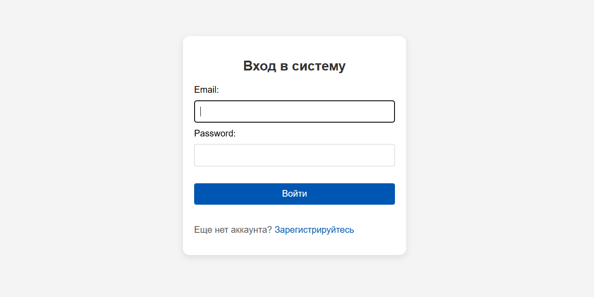

# Лабораторная №2. Введение в Django WEB фреймворк

## Содержание
- Введение
- Условия
- Описание проекта  
- Реализация
- Вывод


### Введение
Темой моего проекта был сайт для регистрации на автогонки с возможностью просмотра прошедших и предстоящих гонок и их результатов, а также просмотра пользователем своих регистраций и управления ими  

### Условия
Табло должно отображать информацию об участниках автогонок: ФИО участника,
название команды, описание автомобиля, описание участника, опыт и класс участника.
Необходимо реализовать следующий функционал:  

1. Регистрация новых пользователей.  
2. Просмотр автогонок и регистрацию гонщиков. Пользователь должен иметь
возможность редактирования и удаления своих регистраций.  
3. Написание отзывов и комментариев к автогонкам. Предварительно
комментатор должен зарегистрироваться. При добавлении комментариев
должны сохраняться даты заезда, текст комментария, тип комментария
(вопрос о сотрудничестве, вопрос о гонках, иное), рейтинг (1-10),
информация о комментаторе.  
4. Администратор должен иметь возможность указания времени заезда и
результата средствами Django-admin.  
5. В клиентской части должна формироваться таблица всех заездов и
результатов конкретной гонки.  


### Описание проекта  
**Авторизация** пользователя происходит через Email и ФИО  
Путь: `accounts/login/`



**Регистрация**. Если у пользователя еще нет аккаунта его можно создать  
Путь: `accounts/register/`


**Домашняя страница** содержит список всех гонок и отображает их карточки с краткой информацией и результатом. На каждую карточку можно перейти по клику  
Путь: `races/`


**Детали гонки**. На странице гонки показана подробная информация о конкретной гонке, отображается список зарегистрированных участников и комментарии, оставленные пользователями. Отсюда можно перейти к регистрации на гонку или форме добавления комментария  
Путь: `races/<int:pk>/`


**Регистрация на гонку**. Добавляет регистрацию авторизованного пользователя на гонку  
Путь: `races/register_racer/<int:pk>/`


**Добавление комментария**. Создает новый комментарий, в котором сохраняется информация о пользователе и гонке, к которой он обращен. Все комментарии о гонке отображаются на странице гонки  
Путь: `races/add_comment/<int:pk>/`


**Список регистраций пользователя**. Отображает список регистраций, принадлежащих авторизованному пользователю. Регистраций можно редактировать и удалять  
Пути:  
`profile/`
`profile/edit_registration/<int:pk>/`
`profile/delete_registration/<int:pk>/`


**Админ-панель**. Для добавления информации о гонках и управлении другими данными. На эту страницу могут попасть только суперюзеры  
Путь: `admin/`


### Реализация
Представления в файле `views.py`:
```python
@login_required
def register_racer(request, race_id):
    if request.method == 'POST':
        form = RegistrationForm(request.POST)

        if form.is_valid():
            registration = form.save(commit=False)
            registration.user = request.user
            race = Race.objects.get(id=race_id)
            registration.race = race
            registration.save()
            return redirect('race_list')
    else:
        form = RegistrationForm()
    return render(request, 'register_racer.html', {'form': form})


@login_required
def edit_registration(request, registration_id):
    registration = get_object_or_404(Registration, id=registration_id)
    
    if registration.user != request.user:
        return HttpResponseForbidden("Вы не можете редактировать эту регистрацию.")
    
    if request.method == 'POST':
        form = RegistrationForm(request.POST, instance=registration)
        if form.is_valid():
            form.save()
            return redirect('profile')
    else:
        form = RegistrationForm(instance=registration)
    
    return render(request, 'edit_registration.html', {'form': form, 'registration': registration})


@login_required
def add_comment(request, race_id):
    if request.method == 'POST':
        form = CommentForm(request.POST)
        if form.is_valid():
            comment = form.save(commit=False)
            comment.user = request.user
            race = Race.objects.get(id=race_id)
            comment.race = race
            comment.save()
            return redirect('race_detailes', pk=race_id)
    else:
        form = CommentForm()
    return render(request, 'add_comment.html', {'form': form})


class RaceList(ListView):
    model = Race
    template_name = 'race_list.html'
    context_object_name = 'races'
    paginate_by = 3

    def get_queryset(self):
        queryset = super().get_queryset()
        search_query = self.request.GET.get('search', '')
        
        if search_query:
            queryset = queryset.filter(name__icontains=search_query)
        
        return queryset


class ProfileList(LoginRequiredMixin, ListView):
    model = Registration
    template_name = 'registration_list.html'
    context_object_name = 'registrations'

    def get_queryset(self):
        return Registration.objects.filter(user=self.request.user)
    

class RaceDetailes(DetailView):
    model = Race
    fields = ['id', 'name', 'date', 'location', 'result']
    template_name = 'race_detailes.html'

    def get_context_data(self, **kwargs):
        context = super().get_context_data(**kwargs)
        race = self.object
        context['comments'] = race.comments.all()
        return context
    
class DeleteRegistration(DeleteView):
    model = Registration
    template_name = 'registration_confirm_delete.html'
    success_url = '/profile'
    

def home(request):
    if not request.user.is_authenticated:
        return redirect('login')
    return redirect('race_list')


def register(request):
    if request.method == 'POST':
        form = UserCreationForm(request.POST)
        if form.is_valid():
            user = form.save()
            login(request, user)
            return redirect('race_list')
    else:
        form = UserCreationForm()
    return render(request, 'register.html', {'form': form})


def login_view(request):
    if request.method == 'POST':
        form = AuthenticationForm(data=request.POST)
        if form.is_valid():
            username = form.cleaned_data.get('username')
            password = form.cleaned_data.get('password')
            user = authenticate(request, username=username, password=password)
            if user is not None:
                login(request, user)
                return redirect('race_list')
    else:
        form = AuthenticationForm()
    return render(request, 'login.html', {'form': form})


def logout_view(request):
    logout(request)
    messages.success(request, "Вы успешно вышли из системы.")
    return redirect('login')
```

Маршруты в файле `urls.py`:
```python
urlpatterns = [
    path('', views.home, name='home'),
    path('profile/', ProfileList.as_view(), name='profile'),
    path('profile/edit_registration/<int:registration_id>/', views.edit_registration, name='edit_registration'),
    path('profile/delete_registration/<int:pk>/', DeleteRegistration.as_view(), name='delete_registration'),
    path('races/', RaceList.as_view(), name='race_list'),
    path('races/<int:pk>', RaceDetailes.as_view(), name='race_detailes'),
    path('races/register_racer/<int:race_id>/', views.register_racer, name='register_racer'),
    path('races/add_comment/<int:race_id>/', views.add_comment, name='add_comment'),
    path('register/', views.register, name='register'),
    path('accounts/login/', views.login_view, name='login'),
    path('accounts/login/', views.logout_view, name='logout'),
]
```


### Вывод

В рамках данной лабораторной работы был разработан и реализован сайт для автолюбителей, которые хотят участвовать в гонках и следить за их результатами. На сайте пользователи могут регистрироваться, просматривать доступные и прошедшие гонки, оставлять комментарии и управлять своими регистрациями.  

Проект позволил закрепить базовые навыки работы с Django, включая:  

- Организацию моделей и маршрутов
- Реализацию пользовательских действий и функционала регистрации и авторизации
- Управление шаблонами и обработкой данных с использованием представлений (как функциональных, так и на основе классов)
- Настройку админ-панели для удобного добавления и редактирования записей