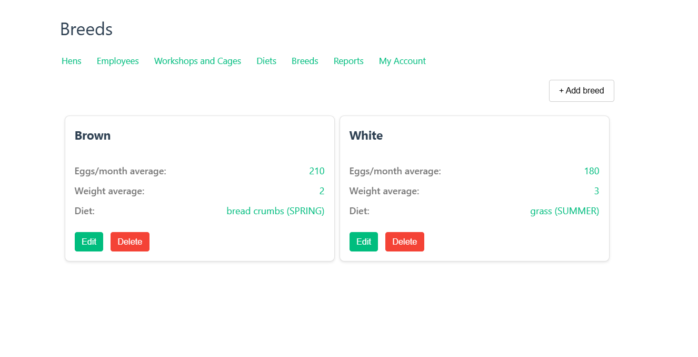

# Лабораторная 4. Реализация клиентской части средствами Vue.js
---

## О проекте

Проект представляет собой веб-приложение для управления птицефермой. 
Основная цель проекта - предоставить удобный инструмент для управления данными о птицеферме, включая информацию о клетках, сотрудниках, породах и диетах.

## Архитектура

Проект состоит из следующих компонентов:

- Фронтенд: реализован с использованием Vue.js и представляет собой веб-интерфейс для взаимодействия с пользователем.
- Бэкенд: реализован с использованием Django и представляет собой серверную часть, отвечающую за обработку и хранение данных. (Реализован в <a href='../lab3/hens/'>лабораторной работе №3</a>)


## Функционал

Проект предоставляет следующие возможности:

- Управление клетками и цехами: добавление, удаление и редактирование информации о клетках.
- Управление сотрудниками: добавление, удаление и редактирование информации о сотрудниках.
- Управление породами: добавление, удаление и редактирование информации о породах.
- Управление диетами: добавление, удаление и редактирование информации о диетах.

## Представления (Views)

### Страница авторизации

Пользователь может авторизоваться на сайте, введя свой логин и пароль.


Код скриптов страницы (фрагмент)

```vue
<script setup>
import { ref } from "vue";
import { useStore } from "vuex";
import { useRouter, useRoute } from 'vue-router';

const router = useRouter();
const route = useRoute();

const store = useStore();
const username = ref("");
const password = ref("");

const IncorrectAuth = ref(false);

const goHome = () => {
      router.push({ name: 'hens' });
    };

const login = () => {
  IncorrectAuth.value = false;
  store.dispatch("userLogin", {
    username: username.value,
    password: password.value,
  })
  .then(() => {
    goHome();
  })
  .catch(() => {
    IncorrectAuth.value = true;
  });
};
</script>
```

### Страница Hens

На этой странице отображаются особи куриц, имеющиеся на ферме с их характеристиками. Каждую карточку можно изменить или удалить, а также есть кнопка для добавления новой особи.


Код скриптов и шаблонов для компоненты карточки курицы

```vue
<script setup>
import { ref } from 'vue';
import { useStore } from 'vuex';
import HenEditPopup from './HenEditPopup.vue';
import DeletePopup from '../DeletePopup.vue';

const store = useStore();

const props = defineProps(['hen']);
const editPopup = ref(null);
const deletePopup = ref(null);

const deleteHen = async (id) => {
  try {
    await store.dispatch('HenStore/deleteHen', props.hen.id);
  } catch (error) {
    console.error('Error deleting hen:', error);
  }
}
</script>

<template>
  <div class="hen-card">
    <!-- Название -->
    <div class="hen-title-block">
      <span class="hen-title">Hen {{ hen.id }}</span>
    </div>

    <!-- Атрибуты -->
    <div class="attributes-block">
      <div class="attribute">
        <span class="attribute-name">Age:</span>
        <span class="attribute-value">{{ hen.age }} years</span>
      </div>
      <div class="attribute">
        <span class="attribute-name">Weight:</span>
        <span class="attribute-value">{{ hen.weight }} kg</span>
      </div>
      <div class="attribute">
        <span class="attribute-name">Eggs per month:</span>
        <span class="attribute-value">{{ hen.eggs_per_month }}</span>
      </div>
      <div class="attribute">
        <span class="attribute-name">Breed:</span>
        <span class="attribute-value">{{ hen.breed.name }}</span>
      </div>
      <div class="attribute">
        <span class="attribute-name">Cage:</span>
        <span v-if="hen.cage" class="attribute-value">{{ `#${hen.cage.cage_number} row ${hen.cage.row_number} WS ${hen.cage.workshop.id}` }}</span>
        <span v-else class="attribute-value">None</span>
      </div>
    </div>

    <!-- Кнопки -->
    <div class="actions">
      <button @click="editPopup.showModal()" type="button" class="edit-btn">Edit</button>
      <button @click="deletePopup.showModal()" type="button" class="delete-btn">Delete</button>
    </div>
  </div>
  <HenEditPopup :hen="hen" ref="editPopup"/>
  <DeletePopup @delete="deleteHen" :title="`Delete hen #${hen.id}`" ref="deletePopup"/>
</template>
```

## Страница Employees

Страница Employees - это страница, на которой отображаются карточки со
сведениями о всех сотрудниках. Каждая карточка содержит ФИО, паспорт,
зарплату, номер контракта, дату окончания контракта, а также список номеров клеток,
которыми сотрудник занимается.


Код скриптов и шаблонов для компоненты карточки работника

```vue
<script setup>
import { computed, inject, ref } from 'vue';
import EmployeeEditPopup from './EmployeeEditPopup.vue';
import DeletePopup from '../DeletePopup.vue';
import { useStore } from 'vuex';

const store = useStore();


const props = defineProps(['employee'])
const editPopup = ref(null)
const deletePopup = ref(null)

const displayedName = computed(() => {
  if (props.employee.name) {
    return props.employee.name
  } else {
    return `Employee ${props.employee.id}`
  }
})

const deleteEmployee = async (id) => {
  try {
    await store.dispatch('EmployeeStore/deleteEmployee', props.employee.id);
  } catch (error) {
    console.error('Error deleting Employee:', error);
  }
}
</script>


<template>
  <div class="employee-card">
    <!-- Название -->
    <div class="employee-title-block">
      <span class="employee-title">{{ displayedName }}</span>
    </div>

    <!-- Атрибуты -->
    <div class="attributes-block">
      <div class="attribute">
        <span class="attribute-name">Passport:</span>
        <span class="attribute-value">{{ employee.passport }}</span>
      </div>
      <div class="attribute">
        <span class="attribute-name">Salary:</span>
        <span class="attribute-value">${{ employee.salary }}</span>
      </div>
      <div class="attribute">
        <span class="attribute-name">Contract:</span>
        <span class="attribute-value">{{ employee.contract }}</span>
      </div>
      <div class="attribute">
        <span class="attribute-name">Termination:</span>
        <span class="attribute-value">{{ employee.termination }}</span>
      </div>
      <div class="attribute">
        <span class="attribute-name">Assigned cages:</span>
        <ul class="attribute-value">
          <li v-for="cage in employee.assigned_cages" :key="cage.id">
            Cage {{ cage.cage_number }} in row {{ cage.row_number }} workshop {{ cage.workshop.id }}
          </li>
        </ul>
      </div>
    </div>

    <!-- Кнопки -->
    <div class="actions">
      <button @click="editPopup.showModal()" type="button" class="edit-btn">Edit</button>
      <button @click="deletePopup.showModal()" type="button" class="delete-btn">Delete</button>
    </div>
  </div>
  <EmployeeEditPopup :employee="employee" ref="editPopup"/>
  <DeletePopup @delete="deleteEmployee" :title="`Delete employee #${employee.id}`" ref="deletePopup"/>
</template>
```

## Страница Workshop and Cages

На странице "Workshop and Cages" представлена информация о цехах и клетках. Каждый элемент отображается в виде карточки, содержащей основные атрибуты, такие как идентификатор, номер ряда, номер клетки и идентификатор мастерской. Карточки также включают кнопки для редактирования и удаления записей. Интерфейс интуитивно понятен и позволяет пользователю легко управлять данными о клетках, а также быстро получать доступ к нужной информации. Дополнительные модальные окна позволяют редактировать или удалять записи, обеспечивая гибкость и удобство в использовании.


Код скриптов и шаблонов для компоненты карточки клетки

```vue
<script setup>
import { ref } from 'vue';
import CageEditPopup from './CageEditPopup.vue';
import DeletePopup from '../DeletePopup.vue';
import { useStore }from 'vuex';

const store = useStore();

const props = defineProps(['cage'])
const editPopup = ref(null)
const deletePopup = ref(null)

const deleteCage = async () => {
  store.dispatch('CageStore/deleteCage', props.cage.id);
  deletePopup.value.close();
}
</script>

<template>
  <div class="cage-card">
    <!-- Название -->
    <div class="cage-title-block">
      <span class="cage-title">Cage {{ cage.id }}</span>
    </div>

    <!-- Атрибуты -->
    <div class="attributes-block">
      <div class="attribute">
        <span class="attribute-name">Workshop:</span>
        <span class="attribute-value">{{ cage.workshop.id }}</span>
      </div>
      <div class="attribute">
        <span class="attribute-name">Row:</span>
        <span class="attribute-value">{{ cage.row_number }}</span>
      </div>
      <div class="attribute">
        <span class="attribute-name">Cage number:</span>
        <span class="attribute-value">{{ cage.cage_number }}</span>
      </div>
    </div>

    <!-- Кнопки -->
    <div class="actions">
      <button @click="editPopup.showModal()" type="button" class="edit-btn">Edit</button>
      <button @click="deletePopup.showModal()" type="button" class="delete-btn">Delete</button>
    </div>
  </div>
  <CageEditPopup :cage="cage" ref="editPopup"/>
  <DeletePopup @delete="deleteCage" :title="`Delete cage #${cage.id}`" ref="deletePopup"/>
</template>
```

## Страница Diets

На странице "Diets" представлена информация о диетах для птиц. Каждая диета отображается в виде карточки, содержащей основные атрибуты, такие как идентификатор, сезон и состав диеты. Карточки также включают кнопки для редактирования и удаления записей, что позволяет пользователю управлять данными о диетах. Модальные окна позволяют редактировать или удалять записи, обеспечивая гибкость и удобство в использовании.


Код скриптов и шаблонов для компоненты карточки диеты

```vue
<script setup>
import { ref } from 'vue';
import { useStore } from 'vuex';
import DietEditPopup from './DietEditPopup.vue';
import DeletePopup from '../DeletePopup.vue';

const props = defineProps(['diet'])
const editPopup = ref(null)
const deletePopup = ref(null)

const store = useStore();

const deleteDiet = async () => {
  try {
    await store.dispatch('DietStore/deleteDiet', props.diet.id);
  } catch (error) {
    console.error('Error deleting diet:', error);
  }
  deletePopup.value.close();
}
</script>

<template>
  <div class="card">
    <!-- Название -->
    <div class="title-block">
      <span class="title">Diet {{ diet.id }}</span>
    </div>

    <!-- Атрибуты -->
    <div class="attributes-block">
      <div class="attribute">
        <span class="attribute-name">Season:</span>
        <span class="attribute-value">{{ diet.season }}</span>
      </div>
      <div class="attribute">
        <span class="attribute-name">Composition:</span>
        <span class="attribute-value">{{ diet.composition }}</span>
      </div>
    </div>

    <!-- Кнопки -->
    <div class="actions">
      <button @click="editPopup.showModal()" type="button" class="edit-btn">Edit</button>
      <button @click="deletePopup.showModal()" type="button" class="delete-btn">Delete</button>
    </div>
  </div>
  <DietEditPopup :diet="diet" ref="editPopup"/>
  <DeletePopup @delete="deleteDiet" :title="`Delete diet #${diet.id}`" ref="deletePopup"/>
</template>
```

## Страница Breeds

Страница "Breeds" отображает список существующих пород, которые хранятся в базе данных. Каждая порода отображается в виде карточки, содержащей основные атрибуты, такие как имя, среднее количество яиц в месяц и масса, а также кнопки для редактирования и удаления записей. Модальные окна позволяют редактировать или удалять записи.



```vue
<script setup>
import { ref } from 'vue';
import BreedEditPopup from './BreedEditPopup.vue';
import DeletePopup from '../DeletePopup.vue';
import { useStore } from 'vuex';

const store = useStore();

const props = defineProps(['breed'])
const editPopup = ref(null)
const deletePopup = ref(null)

const deleteBreed = async () => {
  store.dispatch('BreedStore/deleteBreed', props.breed.id);
  deletePopup.value.close();
}
</script>

<template>
  <div class="card">
    <!-- Название -->
    <div class="title-block">
      <span class="title">{{ breed.name }}</span>
    </div>

    <!-- Атрибуты -->
    <div class="attributes-block">
      <!-- <div class="attribute">
        <span class="attribute-name">Name:</span>
        <span class="attribute-value">{{ breed.name }}</span>
      </div> -->
      <div class="attribute">
        <span class="attribute-name">Eggs/month average:</span>
        <span class="attribute-value">{{ breed.avg_eggs_per_month }}</span>
      </div>
      <div class="attribute">
        <span class="attribute-name">Weight average:</span>
        <span class="attribute-value">{{ breed.avg_weight }}</span>
      </div>
      <div class="attribute">
        <span class="attribute-name">Diet:</span>
        <span class="attribute-value">{{ `${breed.diet.composition} (${breed.diet.season})` }}</span>
      </div>
    </div>

    <!-- Кнопки -->
    <div class="actions">
      <button @click="editPopup.showModal()" type="button" class="edit-btn">Edit</button>
      <button @click="deletePopup.showModal()" type="button" class="delete-btn">Delete</button>
    </div>
  </div>
  <BreedEditPopup :breed="breed" ref="editPopup"/>
  <DeletePopup @delete="deleteBreed" :title="`Delete breed #${breed.id}`" ref="deletePopup"/>
</template>
```

## Страница Reports

На странице отображаются отчеты собранные по имеющимся данным автоматически для владельца фабрики.


```vue
<script setup>
import Navigation from "@/components/Navigation.vue";
import { ref, onMounted } from "vue";

const countHensByBreedWorkshop = ref([]);
const avgEggsPerWorker = ref([]);
const breedVsFactoryDiff = ref([]);
const workshopMaxHensByBreed = ref([]);

const fetchData = async (url) => {
  try {
    const response = await fetch(url);
    const data = await response.json();
    return data;
  } catch (error) {
    console.error("Error loading data:", error);
    return null;
  }
};

onMounted(async () => {
  countHensByBreedWorkshop.value = await fetchData("http://127.0.0.1:8000/hens/count-by-breed-workshop/");
  avgEggsPerWorker.value = await fetchData("http://127.0.0.1:8000/employees/avg-eggs/");
  breedVsFactoryDiff.value = await fetchData("http://127.0.0.1:8000/breeds/vs-factory-average/");
  workshopMaxHensByBreed.value = await fetchData("http://127.0.0.1:8000/workshops/max-hen/");
});
</script>

<template>
  <h1>Reports</h1>
  <Navigation />
  <div class="wrapper">
    <section class="workshop">
    <h2 class="section-title">Number of Hens by Breed and Workshop</h2>
    <table class="styled-table">
      <thead>
        <tr>
          <th>ID Workshop</th>
          <th>Breed</th>
          <th>Total Hens</th>
        </tr>
      </thead>
      <tbody>
        <tr v-for="workshop in countHensByBreedWorkshop" :key="workshop.cage__workshop__id">
          <td>{{ workshop.cage__workshop__id }}</td>
          <td>{{ workshop.breed__name }}</td>
          <td>{{ workshop.total_hens }}</td>
        </tr>
      </tbody>
    </table>
  </section>

  <section class="breed-diff">
    <h2 class="section-title">Difference between breed and factory</h2>
    <table class="styled-table">
      <thead>
        <tr>
          <th>Breed</th>
          <th>Average number of eggs (Breed)</th>
          <th>Difference from factory</th>
        </tr>
      </thead>
      <tbody>
        <tr v-for="breed in breedVsFactoryDiff" :key="breed.breed">
          <td>{{ breed.breed }}</td>
          <td>{{ breed.avg_eggs_breed }}</td>
          <td>{{ breed.diff_from_factory }}</td>
        </tr>
      </tbody>
    </table>
  </section>

  <section class="workshop-max-hens">
    <h2 class="section-title">Workshop with the most hens by breed</h2>
    <table class="styled-table">
      <thead>
        <tr>
          <th>Breed</th>
          <th>ID Workshop</th>
          <th>Total Hens</th>
        </tr>
      </thead>
      <tbody>
        <tr v-for="workshop in workshopMaxHensByBreed" :key="workshop.breed">
          <td>{{ workshop.breed }}</td>
          <td>{{ workshop.workshop }}</td>
          <td>{{ workshop.total_hens }}</td>
        </tr>
      </tbody>
    </table>
  </section>

  <section class="avg-eggs">
    <h2 class="section-title">Average number of eggs collected by worker</h2>
    <table class="styled-table">
      <thead>
        <tr>
          <th>Worker name</th>
          <th>Average number of eggs</th>
        </tr>
      </thead>
      <tbody>
        <tr v-for="worker in avgEggsPerWorker" :key="worker.name">
          <td>{{ worker.name }}</td>
          <td>{{ worker.avg_eggs }}</td>
        </tr>
      </tbody>
    </table>
  </section>
  </div>
</template>
```

## Страница Profile